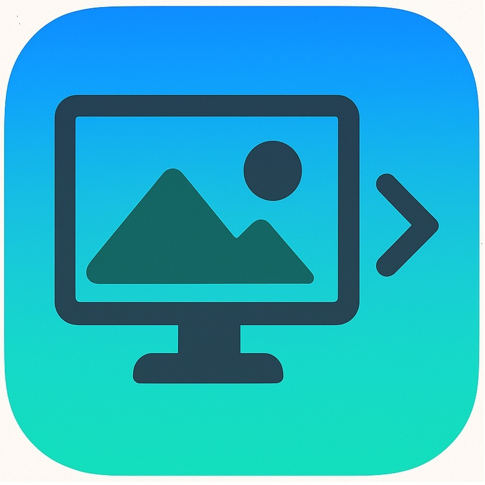
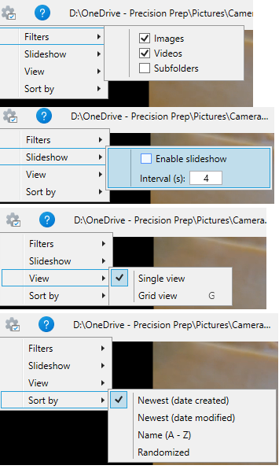
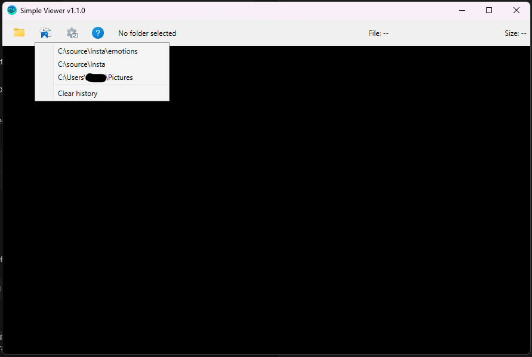
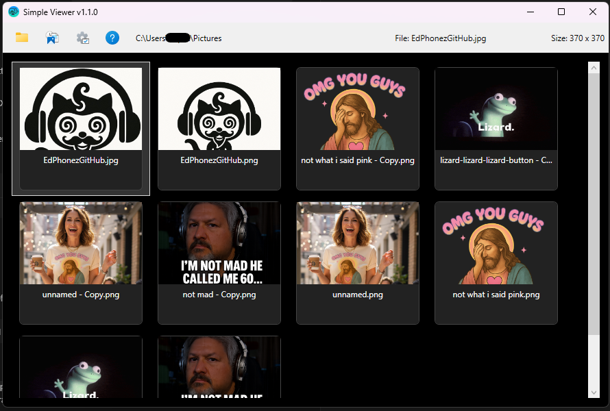
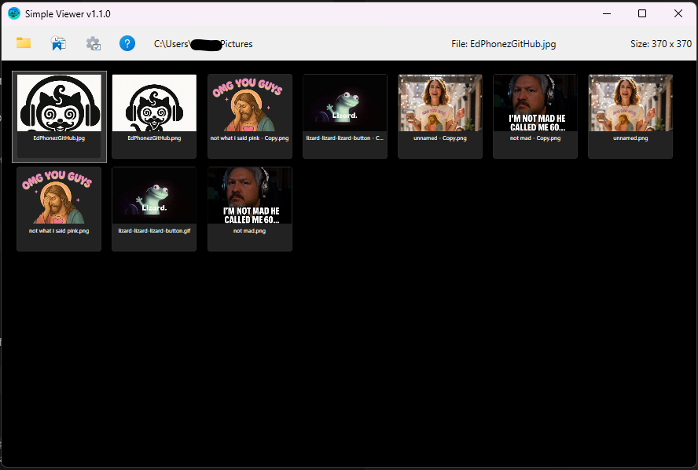
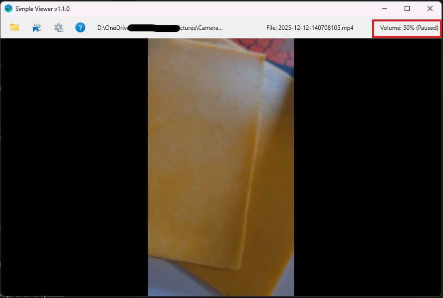

# Simple Viewer

Current Version: **1.1.0**



Simple Viewer is a minimalist Windows desktop app for quickly browsing photos and videos in a distraction-free, full-screen-friendly viewer.

## Features
- Windows-style toolbar with Folder picker, Recent folders, Options gear, and Help buttons
- Open folders or drop any mix of folders/files; choose to append or replace when items are already loaded
- Image/video filters, slideshow with adjustable interval, full-screen toggle (F11) with ESC exit, and Delete-to-`_delete_` cleanup
- Single view plus Grid view (`G`) with Ctrl + mouse wheel zoom and drag-to-pan when zoomed over 100%
- Mouse wheel navigation, arrow keys, `0` to reset zoom, and `Ctrl + C` to copy the current image bitmap
- Video timeline with scrubbing, Up/Down volume keys, `Space` to pause/resume, and `M` for mute
- Metadata panel shows EXIF + Comfy workflow data, includes a Copy button, and toggles with the `X` key
- Recent folders button remembers the last 5 paths with a built-in “Clear history”; optional Explorer context menu installs from Options
- No ads, no telemetry; everything stays local

## What's New in 1.1.0
- **Toolbar & layout**
  - New toolbar layout with Windows icons for Folder picker, Recent folders, Options, and Help.
  - Options compacted into a gear menu that hosts Filters, Slideshow, View (single/grid), and Sort-by sections.
- **Recent folders**
  - New Recent button keeps the last five paths and includes a quick “Clear history” action.
- **Grid view**
  - Grid browsing (press `G`) with thumbnail zoom via Ctrl + mouse wheel and double-click to return to single view.
- **Slideshow**
  - `S` toggles slideshow play/pause, a centered overlay shows the current state, and timers behave better while navigating manually.
- **Viewing & navigation**
  - Mouse wheel cycles through media, Ctrl + wheel zooms images, drag-to-pan when zoomed, `0` resets zoom, and `ESC` now closes the window when not full screen.
- **Media controls**
  - Up/Down adjust video volume, `M` toggles mute, `Space` pauses/resumes playback, and videos share the same zoom/pan gestures as images.
- **Metadata & clipboard**
  - Metadata panel highlights EXIF/Comfy data with a Copy button; `Ctrl + C` copies the current image bitmap directly.
- **Custom selections & Explorer**
  - Drag folders/files into the window-choose Add vs Replace when a session is active.
  - Command-line support accepts folders/files plus an optional `--add` switch to append selections.
  - Options -> Explorer integration installs/removes right-click entries for supported folders and media files.
- **Help & docs**
  - Help window reorganized with grouped shortcuts, embedded change log, refreshed README, and new screenshots.

## Screenshots
| Single View (toolbar + metadata) | Recent Folders flyout |
| --- | --- |
|  |  |

| Grid View (standard) | Grid View (zoomed thumbnails) |
| --- | --- |
|  |  |

| Video Playback with Pause Overlay |
| --- |
|  |

## Download
Grab the latest `SimpleViewer_win-x64.zip` from the [Releases](https://github.com/EdPhon3z/SimpleViewer/releases). Extract the contents anywhere (e.g., `C:\Apps\SimpleViewer`) and run `SimpleViewer.exe`. No separate .NET install is required.

## Getting Started
1. Ensure the [.NET SDK 8.0](https://dotnet.microsoft.com/en-us/download) or newer is installed.
2. Clone this repository and build the WPF project:
   ```powershell
   git clone <repo-url>
   cd "Simple Viewer/SimpleViewer"
   dotnet build
   ```
3. Run the app:
   ```powershell
   dotnet run
   ```
   or launch the generated `SimpleViewer.exe` under `SimpleViewer/bin/Debug/net8.0-windows/`.

## Usage & Controls
- **Select Folder**: Browse to a folder or drag-and-drop folders/files onto the window; choose Add vs Replace when prompted.
- **Recent Folders**: Use the clock/bookmark button to reopen the last five folders or clear the list.
- **Drag & Drop**: Drop media from Explorer—repeat drops can append or replace the current custom selection.
- **Explorer Integration**: Options -> Explorer integration installs/removes right-click menu entries for folders and supported images/videos; "Add" uses the same append behavior as drag-and-drop.
- **Filters**: Toggle Images/Videos checkboxes to limit media types.
- **Slideshow**: Enable slideshow and set interval to auto-advance.
- **Navigation**: Arrow Left/Right (and Up/Down for images) or the mouse wheel move through items; Delete moves current media into `_delete_`; F5 rescans the folder.
- **Full Screen**: Press F11 to toggle chrome and maximize viewing space; ESC exits full screen (or closes the app if already windowed).
- **Zooming/Panning**: Ctrl + mouse wheel zooms images in/out; press `0` (or NumPad `0`) to reset to 100%; click-drag pans when zoomed past 100%.
- **Grid Zoom**: While in Grid view, Ctrl + mouse wheel scales thumbnail size for quick browsing.
- **Video Playback**: Use the scrub bar at the bottom to jump to any timestamp; Up/Down adjust volume, `Space` pauses/resumes, and `M` toggles mute.
- **Video Zooming**: Ctrl + mouse wheel magnifies a playing video; drag to pan when zoomed in.
- **Grid View**: Press `G` or use Options -> View -> Grid to browse thumbnail tiles; double-click a tile to jump back into single view.
- **Sorting**: Options -> Sort by lets you switch between newest, modified, alphabetical, or random ordering of items.
- **Metadata Panel**: Press `X` to toggle metadata (images + videos) with a copy button for the full text.
- **Clipboard**: `Ctrl + C` copies the current image bitmap to the clipboard.
- **Command Line**: Launch `SimpleViewer.exe <folder-or-file> [more paths] [--add]`; `--add` keeps the existing selection and appends the provided paths.

## License
This project is distributed under the [EdPhonez Non-Commercial License (NC-1.0)](https://github.com/EdPhon3z/SimpleViewer/blob/main/LICENSE). Forking and personal/internal use are permitted, but commercial use is prohibited.
